# COMPUTATIONAL THINKING (CT)

# Examples

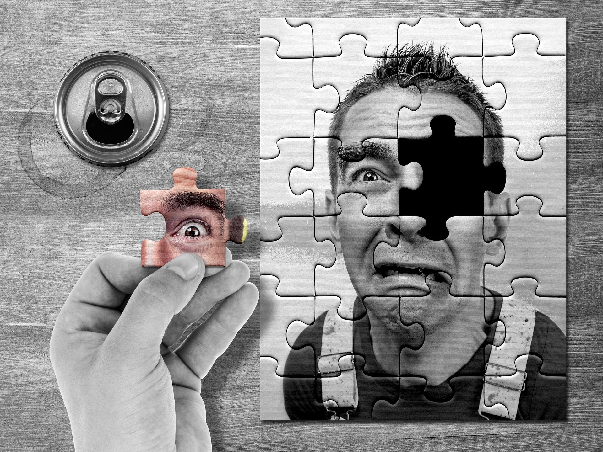

- Cooking
- Driving
- Painting
- Jigsaw
- Math
- Learning a language
- ...(essentially anything you do)

Source: _https://pixabay\.com/_

# Why talk about CT?

- Way of thinking
- Logical approach
- Deterministic \(as opposed to ad\-hoc approach\)

# Target audience

Ages: 0 and above

# Stages

Decomposition

Pattern recognition

Pattern generalisation \(abstraction\)

Algorithm development

Testing

Source: _https://www\.flickr\.com/_

# Decomposition

Breaking a problem down into sub\-components\.

Identifying aspects\, participants\, processes\.

For example\, decomposing the process of making tea leads us to identifying the ingredients \- water\, tea\, sugar\, milk\, etc and also other entities required like kettle\, stove\, strainer\, pot/cups\.

# Pattern recognition

* Identifying patterns that appear in the domain\. For example\, a pattern in the process of tea is that the best flavours are released when
  * the water is in a specific temperature range \(when tea bags are dunked\)
  * the duration of steeping is within a specific time range\.

# Pattern abstraction

* Applying identified patterns to a wider range of scenarios\.
* For example\, you can extend the following parameters that are there for making one cup of tea for making a larger quantity
  * one tablespoon of tea leaves
  * water at 95 degrees celsius
  * steeping time of 3 minutes

# Algorithm

Given a set of inputs\, a well\-defined \(step\-by\-step\) process to achieve a result\.

An algorithm can be more abstract/generic or more specific/detailed

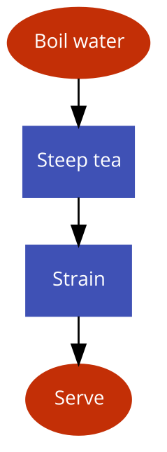

# Tea algorithm
(Generic)

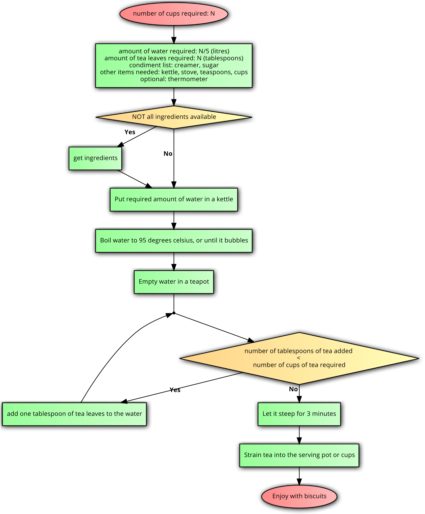

# Tea algorithm
(Specific)

# Testing

Critical\, yet often overlooked step\, of learning from the outcome to modify the process or even the understanding of the process\.

# Activity – Youngest to Oldest

* Sorting birthdays
  * Decomposition
  * Pattern recognition
  * Pattern generalization
  * Algorithm
  * Testing

* Which one comes first?
  * 2nd December or 17th February?
  * 15th March or 28th March?
  * 4th April or 4th April?

# Activity - Searching

# Find "ZIGZAG"

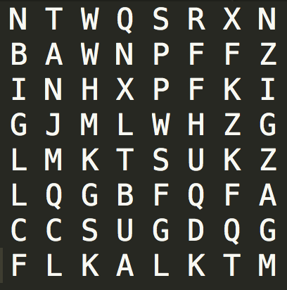

# Find "WHAT"

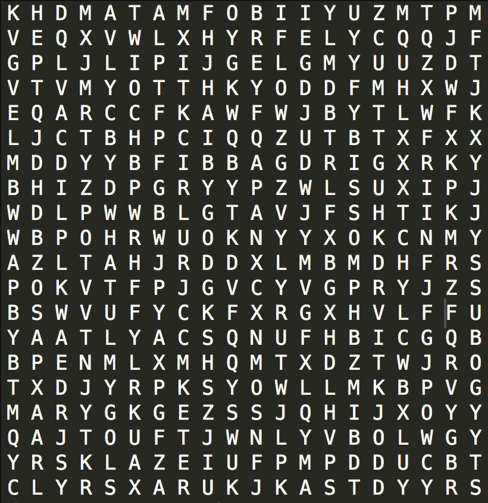

# Find "NICE"

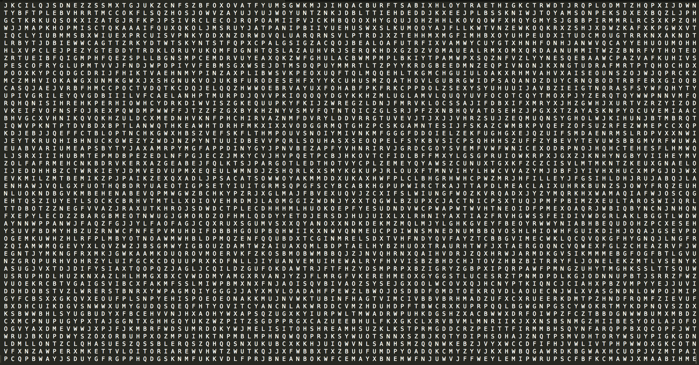

# Search techniques

Random search \(sometimes known as "visual inspection"\)

Linear search \(systematically eliminating items\)

Binary search \(requires ordered/sorted data\)

# Linear search
Algorithm

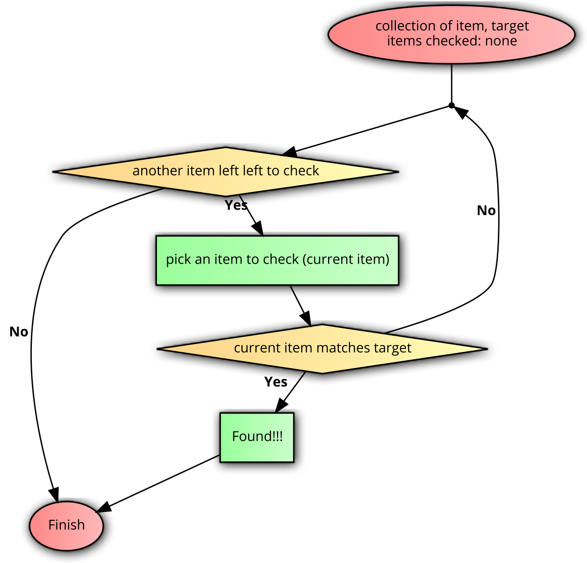

# I’ve got the blues

# Is this color present in the gradient?

# Approach 1 step 1

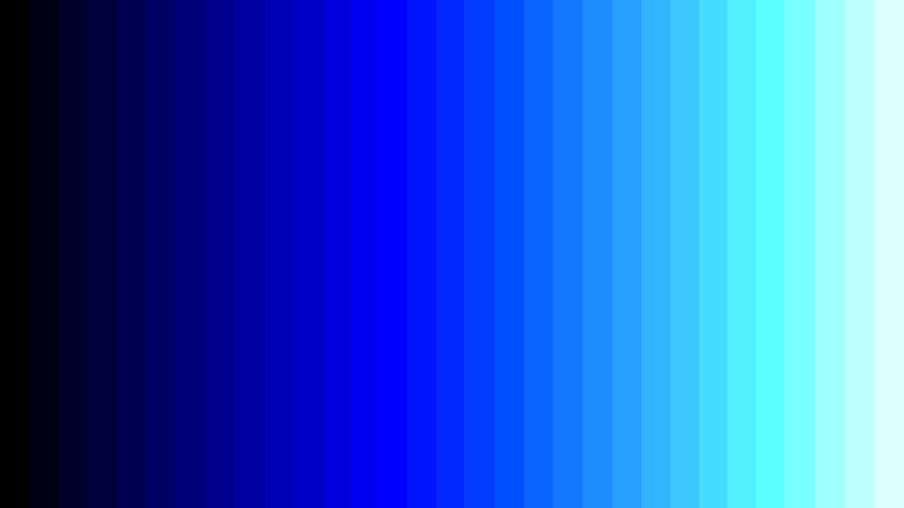

# IS IT EFFICIENT?

# I’ve got the blues

# Checkpoint 1 - Pass/Fail?

# Estimate of checkpoints required?

* Let’s say we start with __16__ values
  * After 1st checkpoint\, we are left with __8__ values
  * After 2nd checkpoint\, we are left with __4__ values
  * After 3rd checkpoint\, we are left with __2__ values
  * After 4th  checkpoint\, we are left with __1__ value
* Total checkpoints to go from 16 to 1 = __4__

* Let’s say we start with __32__ values
  * After 1st checkpoint\, we are left with __16__ values
    * __and then__ it takes another 4 checkpoints to reach 1 value\.
  * So\, total checkpoints to go from 32 to 1 = 5

* Let’s say we start with __64__ values
  * After 1st checkpoint\, we are left with __32__ values
    * __and then__ it takes another 5 checkpoints to reach 1 value\.
  * So\, total checkpoints to go from 64 to 1 = 6

Checkpoints required to go from __N to 1__ =

\(Checkpoints required to go from __N/2 to 1__ \) __\+ 1__

# Binary search benefits

With each comparison\, the _search space_  _is_ halved _\._

To apply binary search on a data of twice the size \(compared to current data\)\, you only need 1 extra comparison\.

# ACTIVITY - Sudoku

* Sudoku
  * Sudoku is defined as a square grid with N rows\, N columns where N is a square \(so 1\, 4\, 9\, 16\, …\)\. Let’s say the square root of N is K \(So if N = 4\, K = 2\)
    * Sudoku grids are of size 1 by 1\, 4 by 4\, 9 by 9\, 16 by 16\, …
  * N unique symbols can be placed in each of the cells\.
  * Aim is to start with a partially filled grid and fill it such that no symbol appears more than once in each
    * rows\,
    * column\,
    * block \(defined as K by K sub grid\)\.

# 4 by 4 Sudoku board

# 4 by 4 Sudoku board - rows

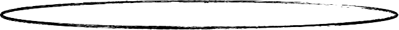

# 4 by 4 Sudoku board - columns

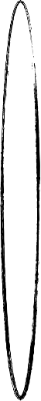

# 4 by 4 Sudoku board - blocks

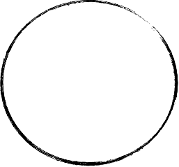

# Starting point

# Filled 4 by 4 Sudoku board

# Each row has every symbol

# Each column has every symbol

# Each block has every symbol

# Sudoku - Decomposition

# Sudoku - Pattern recognition

# Sudoku - Pattern generalization

# Sudoku - Algorithm

# Sudoku - Testing

# Testing sample 1

# Sudoku is ALL about 
Search and repeat

# ACTIVITY

* Each group will now solve
  * 1 x 4 by 4 sudoku
  * 1 x 9 by 9 sudoku
  * 1 x 16 by 16 sudoku
    * \(16 symbols are 0 through 9 and A through F\)

# ACTIVITY – NUMBER SYSTEMS

# Number Systems

Why decimal?

# Breaking down a number

* 1729 =
  * 1\*1000 \+
  * 7\*100 \+
  * 2\*10 \+
  * 9\*1

* 1729 =
  * 1\*10^3 \+
  * 7\*10^2 \+
  * 2\*10^1 \+
  * 9\*10^0
* Where 10 is the number of symbols in the number system\.
* This representation is called _sum of products_ \.

* 1729 =
  * 1\* _10_ ^3 \+
  * 7\* _10_ ^2 \+
  * 2\* _10_ ^1 \+
  * 9\* _10_ ^0
  * Why is the base of the weight always 10?

# Decimal Number System

* Decomposition: Symbols \(0 to 9\)
* Pattern recognition: Digit\, weight
  * For example\, weight of 7 in 1729 is 100
* Pattern generalization
  * Other number systems

# Breaking down a binary number

* Binary has 2 symbols \(0\, 1\)
* Can you break down the following binary number?
  * 10111

* 10111 =
  * 1\*2^4 \+
  * 0\*2^3 \+
  * 1\*2^2 \+
  * 1\*2^1 \+
  * 1\*2^0
* Where 2 is the number of symbols in the number system\.

# Pattern recognition

* Is 11101010101 a valid binary number?
* What about 11101010201? Why\, or why not?
* What do we learn from this?
  * A base\-N number can only contain symbols 0 to N\-1

# Activity

Pick a number system \(say\, between base\-2 and base\-10\)

Think of a number in that number system

Represent it as sum of products\.

