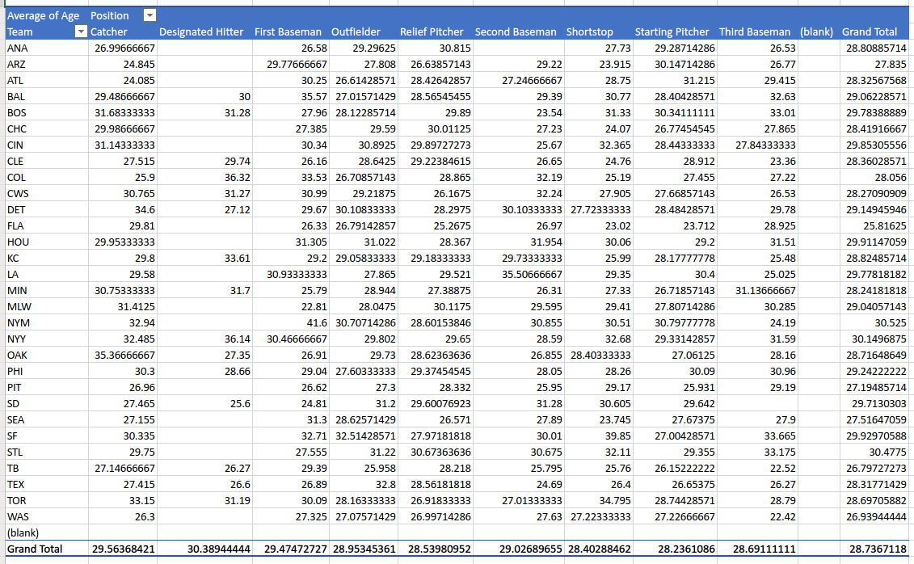
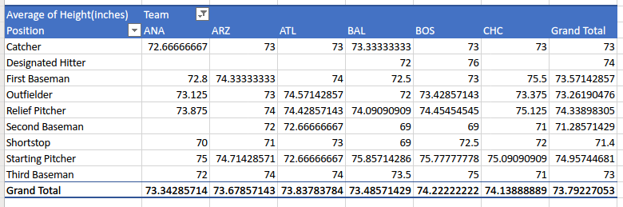

# Week 9 SGTA (Internal offering)
# PRAC_01

## In-class Quiz 3

In this session you will complete in-class quiz 3. The participation task will be based on your completion of the quiz.

# PRAC_02

## Activity 1 - Processing long tables in Excel (20 minutes + 10 minutes discussion)

Refer to the file mlb_players.csv. For your reference, below you can see the first rows of the file.

```
"Name", "Team", "Position", "Height(inches)", "Weight(lbs)", "Age"
"Adam Donachie", "BAL", "Catcher", 74, 180, 22.99
"Paul Bako", "BAL", "Catcher", 74, 215, 34.69
"Ramon Hernandez", "BAL", "Catcher", 72, 210, 30.78
"Kevin Millar", "BAL", "First Baseman", 72, 210, 35.43
"Chris Gomez", "BAL", "First Baseman", 73, 188, 35.71
"Brian Roberts", "BAL", "Second Baseman", 69, 176, 29.39
"Miguel Tejada", "BAL", "Shortstop", 69, 209, 30.77
"Melvin Mora", "BAL", "Third Baseman", 71, 200, 35.07
"Aubrey Huff", "BAL", "Third Baseman", 76, 231, 30.19
"Adam Stern", "BAL", "Outfielder", 71, 180, 27.05
"Jeff Fiorentino", "BAL", "Outfielder", 73, 188, 23.88
"Freddie Bynum", "BAL", "Outfielder", 73, 180, 26.96
"Nick Markakis", "BAL", "Outfielder", 74, 185, 23.29
"Brandon Fahey", "BAL", "Outfielder", 74, 160, 26.11
"Corey Patterson", "BAL", "Outfielder", 69, 180, 27.55
"Jay Payton", "BAL", "Outfielder", 70, 185, 34.27
```
Write the instructions for performing the following tasks with these data in Excel.

1. How can you determine all the positions listed in the file?
2. Without using pivot tables, how can you determine the average height of all players in the "Catcher" position?
3. Using pivot tables, how can you determine the average age of all outfielders of team "BAL"?

## Activity 2 - Date formats (10 minutes + 10 minutes discussion)

Both Excel and MATLAB offer the option to convert datetime values to text, and read dates from text, using different formats. Review the following information about the different format patterns available in each language:

* Excel date formats
  * Documentation from Microsoft: https://support.microsoft.com/en-us/office/format-a-date-the-way-you-want-8e10019e-d5d8-47a1-ba95-db95123d273e
* MATLAB date formats
  * Documentation from MATLAB: https://www.mathworks.com/help/matlab/ref/datetime.html#buhzxmk-1-Format

Fill the following table. The first row has been filled for your convenience.

| Date | Format in Excel | Format in MATLAB |
|---|---|---|
| 9/04/2014 | d/mm/yyyy | d/MM/yyyy|
| 09/04/2014 | 
| April 9, 14 | 
| Apr 29, 2014 9:41 PM | 
| 08-Mar-2015 19:25 | 

## Participation task

Submit your answer to activity 2 as a Word, PDF, Excel, or OpenOffice file.

## OPTIONAL Activity 3 - Excel's pivot tables (15 minutes + 10 minutes discussion)

Refer to the file mlb_players.csv of activity 3. Below are several screenshots of pivot tables created from the data from mlb-players.csv. For each screenshot, explain how it has been produced. (*Note: the screenshots are from Excel Online, the pivot table might look different in other versions of Excel*)

### Screenshot 1



### Screenshot 2



